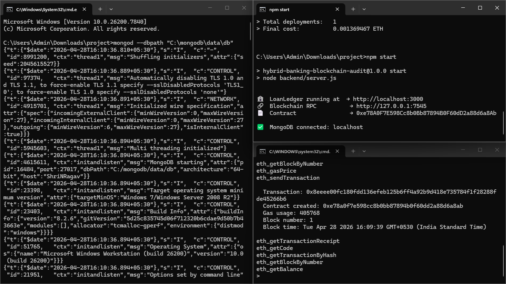
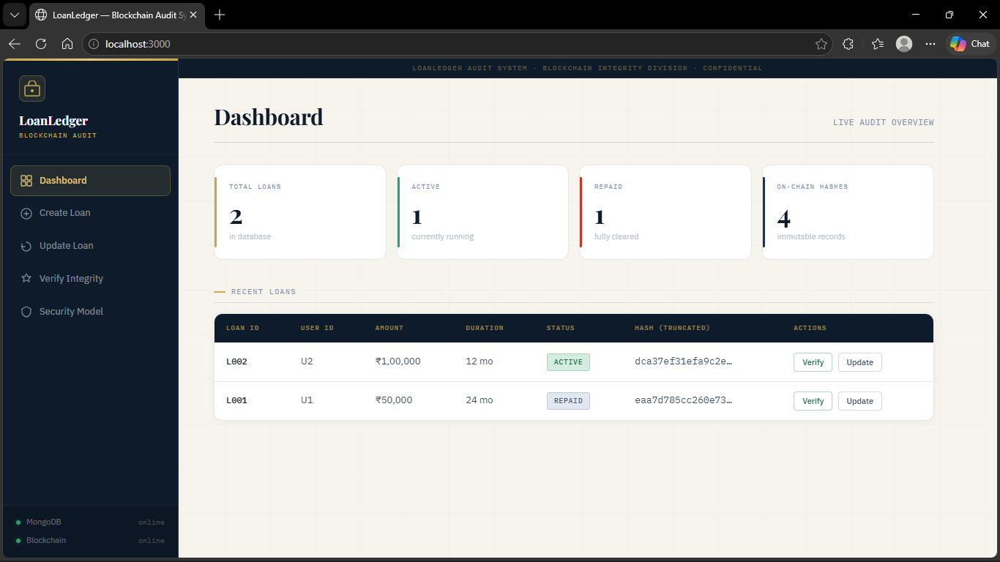

# 🏦 Blockchain-Based Loan Management Framwork

A **centralized banking system** that uses a local Ethereum blockchain (Ganache)
**exclusively for data integrity and audit purposes** — no cryptocurrency, no
wallets, no DeFi.

```
User → Express API → MongoDB (source of truth)
                   ↓  SHA256 hash
             Ganache Blockchain (immutable audit log)
```

---

## Tech Stack

| Layer       | Technology                         |
|-------------|-------------------------------------|
| Backend     | Node.js + Express.js                |
| Database    | MongoDB (Mongoose)                  |
| Blockchain  | Ganache (local) + Solidity 0.8      |
| Web3 bridge | Web3.js v4                          |
| Deployment  | Truffle                             |

---

## Project Structure

```
bblmf/
├── contracts/
│   └── LoanLedger.sol              # Solidity contract (hash storage only)
├── migrations/
│   └── 2_deploy_loan_ledger.js     # Truffle migration
├── build/
│   └── contracts/
│       └── LoanLedger.json         # Auto-generated after compile
├── backend/
│   ├── server.js                   # Express entry point
│   ├── models/
│   │   └── LoanRecord.js           # Mongoose schema
│   ├── routes/
│   │   └── loanRoutes.js           # API routes
│   ├── controllers/
│   │   └── loanController.js       # Business logic
│   ├── blockchain/
│   │   └── ledger.js               # Web3 read/write wrappers
│   └── utils/
│       └── hash.js                 # SHA256 hash helper
├── config/
│   ├── db.js                       # MongoDB connection
│   └── blockchain.js               # Web3 + contract instance
├── .env.example                    # Environment variable template
├── truffle-config.js
└── package.json
```

---

## Setup Instructions

### Prerequisites

```bash
node --version    # v18+ recommended
npm  --version    # v9+
mongod --version  # MongoDB running locally
```

Install global tools (once):

```bash
npm install -g truffle
# Either install Ganache GUI: https://trufflesuite.com/ganache/
# Or use CLI:
npm install -g ganache
```

---

### Step 1 — Clone & Install

```bash
cd hybrid-banking
npm install
```

---

### Step 2 — Start Ganache

**Option A — Ganache GUI**
1. Open Ganache app
2. Click "Quickstart Ethereum"
3. Note the RPC Server (usually `http://127.0.0.1:7545`)
4. Copy any account address from the "Accounts" tab

**Option B — Ganache CLI**

```bash
ganache --port 7545 --deterministic
# --deterministic gives the same accounts every run (easier for dev)
```

---

### Step 3 — Configure Environment

```bash
cp .env.example .env
```

Edit `.env`:

```env
MONGO_URI=mongodb://localhost:27017/bblmf
BLOCKCHAIN_RPC=http://127.0.0.1:7545
CONTRACT_ADDRESS=           # fill in after Step 4
BLOCKCHAIN_ACCOUNT=         # paste a Ganache account address
PORT=3000
```

---

### Step 4 — Compile & Deploy Smart Contract

```bash
# Compile Solidity → builds ABI in build/contracts/
npm run compile

# Deploy to Ganache
npm run migrate
```

Expected output:

```
Deploying 'LoanLedger'
   ---------------------
   > contract address:  0xAbCd...1234   ← copy this!
   > transaction hash:  0x...
   > gas used:          312049
```

Copy the **contract address** into `.env`:

```env
CONTRACT_ADDRESS=0xAbCd...1234
```

---

### Step 5 — Start the Backend

```bash
npm start
# or for live reload:
npm run dev
```

Output:

```
✅  MongoDB connected: localhost
🏦  Hybrid Banking server running on http://localhost:3000
🔗  Blockchain RPC : http://127.0.0.1:7545
📄  Contract       : 0xAbCd...1234
```

---

## API Reference

### Base URL: `http://localhost:3000/api/loans`

---

#### POST `/create-loan`

Create a new loan and record its hash on the blockchain.

**Request Body:**
```json
{
  "loanId":   "LOAN-001",
  "userId":   "USER-42",
  "amount":   50000,
  "interest": 8.5,
  "duration": 24,
  "status":   "ACTIVE"
}
```

**Response 201:**
```json
{
  "message":          "Loan created and recorded on blockchain.",
  "loanId":           "LOAN-001",
  "hash":             "a3f8d...c4e2",
  "blockchainTxHash": "0x7f3b..."
}
```

---

#### POST `/update-loan`

Update loan status. A new hash is computed and appended to the blockchain audit trail.

**Request Body:**
```json
{
  "loanId": "LOAN-001",
  "status": "REPAID"
}
```

**Response 200:**
```json
{
  "message":          "Loan updated and new hash recorded on blockchain.",
  "loanId":           "LOAN-001",
  "newHash":          "d9a1b...3f72",
  "blockchainTxHash": "0x2a8c...",
  "versionKey":       "UPDATE-LOAN-001-1"
}
```

---

#### GET `/verify-loan/:loanId`

Verify integrity: re-computes hash from DB and compares with blockchain.

**Response 200 — intact record:**
```json
{
  "loanId":             "LOAN-001",
  "integrity":          "✅ VALID",
  "recomputedHash":     "a3f8d...c4e2",
  "blockchainHash":     "a3f8d...c4e2",
  "blockchainTimestamp": "2024-01-15T10:30:00.000Z",
  "dbCurrentHash":      "d9a1b...3f72",
  "hashHistory": [
    { "hash": "a3f8d...", "txHash": "0x7f3b...", "reason": "CREATED" },
    { "hash": "d9a1b...", "txHash": "0x2a8c...", "reason": "UPDATED" }
  ]
}
```

**Response 200 — tampered record:**
```json
{
  "loanId":         "LOAN-001",
  "integrity":      "⚠️  TAMPERED",
  "recomputedHash": "XXXXX...different",
  "blockchainHash": "a3f8d...c4e2"
}
```

---

#### GET `/loan/:loanId`

Fetch the raw loan document from MongoDB.

---

## How Integrity Verification Works

```
1. API receives GET /verify-loan/LOAN-001

2. MongoDB → fetch loan document
   {loanId, userId, amount, interest, duration, status, timestamp}

3. Backend re-serialises fields in FIXED ORDER → SHA256
   recomputedHash = sha256(JSON.stringify({loanId, userId, ...}))

4. Blockchain → getRecord("LOAN-001")
   returns { hash: "a3f8...", timestamp: 1705..., exists: true }

5. Compare:
   recomputedHash === blockchainHash  →  ✅ VALID
   recomputedHash !== blockchainHash  →  ⚠️  TAMPERED
```

If anyone modifies the MongoDB document directly (bypassing the API), the
re-computed hash will no longer match the immutable hash on the blockchain —
exposing the tampering instantly.

---

## Smart Contract Overview

```solidity
// LoanLedger.sol — hash storage only, no tokens, no transfers
mapping(string => LoanEntry) private records;

function storeRecord(string loanId, string hash) external {
    require(!records[loanId].exists, "immutable — cannot overwrite");
    records[loanId] = LoanEntry(hash, block.timestamp, true);
}

function getRecord(string loanId) external view
    returns (string hash, uint256 timestamp, bool exists);
```

**What this contract does NOT do:**
- Handle ETH / tokens
- Require MetaMask
- Allow deletes or updates (immutable by design)

---

## Quick Test (curl)

```bash
# 1. Create
curl -X POST http://localhost:3000/api/loans/create-loan \
  -H "Content-Type: application/json" \
  -d '{"loanId":"L001","userId":"U1","amount":10000,"interest":7.5,"duration":12}'

# 2. Verify (should be VALID)
curl http://localhost:3000/api/loans/verify-loan/L001

# 3. Update status
curl -X POST http://localhost:3000/api/loans/update-loan \
  -H "Content-Type: application/json" \
  -d '{"loanId":"L001","status":"REPAID"}'

# 4. Verify again
curl http://localhost:3000/api/loans/verify-loan/L001
```

---
## 📸 Screenshots

### Terminal


### Dashboard


### Create Loan Record


### Updated Dashboard


## Troubleshooting

| Error | Fix |
|-------|-----|
| `LoanLedger.json not found` | Run `npm run compile && npm run migrate` |
| `CONTRACT_ADDRESS not set` | Paste address from migration output into `.env` |
| `MongoDB connection failed` | Ensure `mongod` is running |
| `Cannot connect to Ganache` | Start Ganache and check `BLOCKCHAIN_RPC` port |
| `Record already exists` | Blockchain is immutable — loanId must be unique |

---

## Security Notes

- This is a **development** setup using Ganache (local chain).
- For production use a private permissioned chain (e.g. Hyperledger Besu, Quorum).
- Never expose the `BLOCKCHAIN_ACCOUNT` private key; use a secrets manager.
- The blockchain is used only for **audit hashes** — no funds are ever transferred.

[](buymeacoffee.com/nerd5238)
